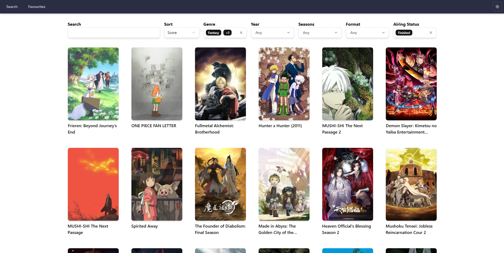

# [Animext](https://animext.vercel.app)

## Overview

A Next.js anime web app with features inspired by AniList using their public GraphQL API.



## Features

- **Anime Discovery**: Browse and search through a curated list of anime
- **Favourites System**: Keep track of favorited anime with no sign-in required
- **Theme Toggling**: Pick between light and dark theme modes
- **Mobile Support**: View the app from any device thanks to its responsive design

## Tech Stack
- Next.js / React
- TypeScript
- Tailwind
- Shadcn

## Getting Started

```bash
# node and npm required
npm install
npm run dev
# enter https://localhost:3000
```
